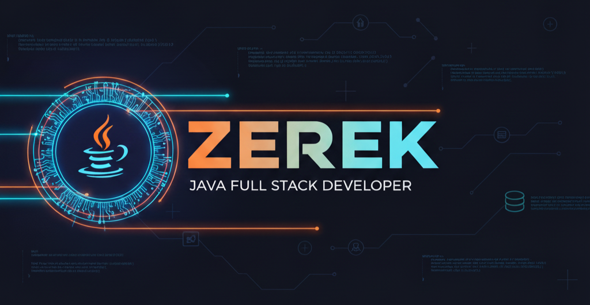
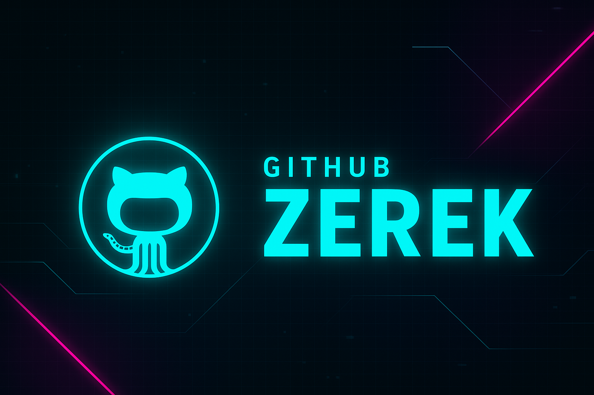

<!-- Banner responsive centrado -->

  

---

## Who am I?      
<!-- ===========================
     WHO AM I — Profesional (Java Full-Stack + Hacking ético)
   =========================== -->
<h2 align="center">👋 Hola — soy <strong>Zerek</strong></h2>

  Desarrollador <strong>Java Full-Stack</strong> · Ingeniería de software · <strong>Hacking ético</strong> 
  Transformo requisitos en APIs seguras, UIs limpias y despliegues reproducibles.

  

## 🚀 Resumen profesional
- 🔧 Backend: **Java + Spring Boot** (APIs REST, seguridad, testing, integración DB).  
- ⚛️ Frontend: **React** (hooks, SPA, consumo de APIs).  
- 📦 DevOps: **Docker**, CI (GitHub Actions), despliegues reproducibles.  
- 🔐 Seguridad: OWASP Top10, análisis de dependencias, pruebas en entornos autorizados.

## 🛠 Programming languages

	

## Frameworks and Libraries

	

## Software and Tools

  

## Operating Systems

	

## Databases and Cloud hosting

  

## 📫 Get in touch

  
	
	
	</a>
	

<em>Siempre aprendiendo, siempre asegurando. ⚡</em>

---

